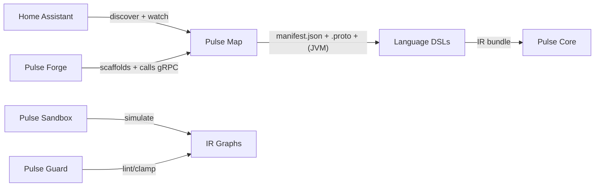

# Pulse Map

[](https://github.com/PulseAutomate/pulse-map/actions)
[](https://github.com/PulseAutomate/pulse-map/releases)
[](#license)


[](#contributing)

**Pulse Map** is the Home Assistant discovery & codegen tool in the **PulseAutomate** ecosystem. It connects to your HA instance, builds a stable-ID **manifest** of entities & services, and generates **Protocol Buffers** (plus optional **JVM bindings**) for language-agnostic development. The MVP includes **Mapped Attributes** and **Attribute Enums**, so you can query **what a device can do** with **typed, string-free accessors**.

> 💡 *Map discovers & describes. DSLs consume. Core executes.*
> Map does **not** run automations; that’s **Pulse Core**.

---

## Table of Contents

* [Why Pulse Map?](#why-pulse-map)
* [How It Fits (PulseAutomate System)](#how-it-fits-pulseautomate-system)
* [Status](#status)
* [Features (MVP)](#features-mvp)
* [Requirements](#requirements)
* [Install](#install)
* [Quickstart](#quickstart)
* [CLI Usage](#cli-usage)
* [Daemon Usage](#daemon-usage)
* [Configuration](#configuration)
* [Manifest Schema (v1)](#manifest-schema-v1)
* [Generated Outputs](#generated-outputs)
* [Project Layout](#project-layout)
* [Build From Source](#build-from-source)
* [Development Tips (IntelliJ)](#development-tips-intellij)
* [Roadmap](#roadmap)
* [Versioning & Compatibility](#versioning--compatibility)
* [Contributing](#contributing)
* [Code of Conduct](#code-of-conduct)
* [Security](#security)
* [License](#license)
* [Community & Links](#community--links)

---

## Why Pulse Map?

Home Assistant entity IDs and service signatures can drift (renames, integration changes). Pulse Map:

* Creates **stable IDs** so your code/DSL won’t break when `light.kitchen` becomes `light.kitchen_ceiling`.
* Produces **language-agnostic** Protobuf types your DSL can codegen against.
* Ships an always-on **daemon** to keep your dev workspace synchronized with HA.
* (**MVP**) Adds **Mapped Attributes + Attribute Enums** to access attributes & device capabilities **without magic strings**:

    * `Attrs.climate(E.climate.LIVING_ROOM_TRV).hvacMode()` → `ClimateHvacMode` enum
    * `Capabilities.climate(E.climate.LIVING_ROOM_TRV).targetTemperatureC()` → `{min,max,step}` for safe writes

## How It Fits (PulseAutomate System)



**PulseAutomate** is a language-agnostic automation stack:

* **Pulse Map** → discovery, typed attributes/capabilities & codegen (this repo)
* **Pulse Core** → IR executor inside HA
* **Pulse Forge** → project scaffolding & toolchain glue
* **Pulse Sandbox** → simulation & testing
* **Pulse Guard** → linting / clamps (uses device capability ranges)

## Status

**Pre-MVP / in active development.** Expect frequent changes while we stabilize the manifest and codegen APIs. Follow the [Milestones](../../milestones) for progress.

---

## Features (MVP)

* **CLI-first** workflow (GraalVM native binary option) + optional **`mapd`** gRPC daemon
* **Stable-ID manifest** (`manifest.json`) + reproducible **lock file** (`map.lock.json`)
* **Protobuf codegen** for language-agnostic consumption
* **(MVP) JVM bindings**: `Entities`, `Services`, `Attrs`, `Capabilities`, **Domain Enums**
* **Mapped Attributes + Attribute Enums** (MVP)

    * Typed getters for common attributes (e.g., `hvacMode`, `targetTemperatureC`)
    * Per-device **capabilities** (min/max/step) for clamp-safe writes
* **Two sync modes**

    * **Suggestion**: stream changes; prompt tools/you to regenerate
    * **Aggressive**: auto-regenerate on changes

## Requirements

* **Java 21+** (Temurin/Zulu recommended)
* Home Assistant URL + Long-Lived Access Token
* Linux x64/aarch64 supported for native builds (JVM works cross-platform)

---

## Install

**Option A — Download release binaries** (recommended)

1. Go to [Releases](../../releases) and download the latest assets for your platform.
2. Extract and place `pulse-map` (CLI) and optionally `pulse-mapd` (daemon) on your PATH.

**Option B — Build from source**: see [Build From Source](#build-from-source).

---

## Quickstart

1. **Discover** your HA instance → `manifest.json` + `map.lock.json`

```bash
./pulse-map discover \
  --url http://ha.local:8123 \
  --token $PULSE_HA_TOKEN \
  --out ./build/pulse/manifest.json
```

2. **Generate Protobuf** (language-agnostic)

```bash
./pulse-map proto \
  --manifest ./build/pulse/manifest.json \
  --out ./build/generated/proto
```

3. **(Optional) Generate JVM bindings** with typed attributes & caps

```bash
./pulse-map java \
  --manifest ./build/pulse/manifest.json \
  --package com.example.home.gen \
  --out ./build/generated/java
```

**Example (Java MVP)**

```java
// Read typed attributes (no strings)
var mode   = Attrs.climate(E.climate.LIVING_ROOM_TRV).hvacMode();       // ClimateHvacMode enum
var setptC = Attrs.climate(E.climate.LIVING_ROOM_TRV).targetTemperatureC(); // double or Temperature type

// Safe write clamped to device capabilities
var caps = Capabilities.climate(E.climate.LIVING_ROOM_TRV).targetTemperatureC(); // {min,max,step}
var safe = Temperature.celsius(19.0).clamp(caps);
call(S.climate.setTemperature(E.climate.LIVING_ROOM_TRV).temperature(safe));
```

---

## CLI Usage

```bash
# Help
./pulse-map --help
./pulse-map discover --help
./pulse-map proto --help
./pulse-map java --help

# Typical flow
./pulse-map discover --url http://ha.local:8123 --token $PULSE_HA_TOKEN --out ./build/pulse/manifest.json
./pulse-map proto     --manifest ./build/pulse/manifest.json --out ./build/generated/proto
./pulse-map java      --manifest ./build/pulse/manifest.json --package com.example.home.gen --out ./build/generated/java
```

## Daemon Usage

```bash
# Start daemon
./pulse-mapd start \
  --url $PULSE_HA_URL \
  --token $PULSE_HA_TOKEN \
  --workdir ./build/pulse

# Choose sync mode
./pulse-mapd mode --suggestion     # or --aggressive

# Status / stop
./pulse-mapd status
./pulse-mapd stop
```

**gRPC API (high level)**

```proto
service MapService {
  rpc Discover(DiscoverRequest) returns (DiscoverReply);
  rpc GenerateProto(GenRequest) returns (GenReply);
  rpc GenerateJvm(GenJvmRequest) returns (GenReply);
  rpc Watch(WatchRequest) returns (stream WatchEvent);
  rpc SetMode(SetModeRequest) returns (StatusReply);
  rpc Status(google.protobuf.Empty) returns (StatusReply);
}
```

---

## Configuration

Environment variables are optional but convenient:

* `PULSE_HA_URL` — Home Assistant base URL (e.g. `http://ha.local:8123`)
* `PULSE_HA_TOKEN` — Home Assistant Long-Lived Access Token
* `PULSE_WORKDIR` — Default working directory for manifest/lock/codegen outputs

CLI flags override environment variables.

---

## Manifest Schema (v1)

**`manifest.json` (excerpt):**

```json
{
  "schema": 1,
  "ha_version": "2025.6",
  "entities": [
    {
      "stable_id": "stable:aa12…",
      "entity_id": "climate.living_room_trv",
      "domain": "climate",
      "device_class": "heater",
      "attributes": {
        "hvac_mode":     { "kind": "enum",   "enum": ["off","heat","auto"] },
        "preset_mode":   { "kind": "enum",   "enum": ["eco","comfort"], "optional": true },
        "current_temp_c":{ "kind": "number", "unit": "°C" },
        "target_temp_c": { "kind": "number", "unit": "°C",
                             "caps": { "min": 5.0, "max": 30.0, "step": 0.5 } }
      }
    }
  ],
  "services": [
    {
      "domain": "climate",
      "service": "set_temperature",
      "fields": {
        "temperature": { "type": "number", "unit": "°C", "required": true }
      }
    }
  ]
}
```

**`map.lock.json` (excerpt):**

```json
{
  "schema": 1,
  "manifest_hash": "sha256:…",
  "generated_at": "2025-08-14T19:00:00Z",
  "entity_map": { "climate.living_room_trv": "stable:aa12…" },
  "service_sig": { "climate.set_temperature": "fields-hash" },
  "attr_enums": { "climate.hvac_mode": ["OFF","HEAT","AUTO"] }
}
```

**Notes**

* `stable_id` derives from HA registry `unique_id` (preferred) or a durable composite; it is invariant across renames.
* Attribute descriptors carry `kind`, optional `unit`, optional `enum`, and optional `caps` with `{min,max,step}`.

---

## Generated Outputs

* `build/generated/proto/`

    * `manifest.proto`, `entities.proto`, `services.proto`, **`attributes.proto`**
* `build/generated/java/` *(optional MVP)*

    * `…/gen/Entities.java` (stable refs per domain)
    * `…/gen/services/...` (typed service builders)
    * **`…/gen/Attrs/...`** (typed attribute accessors)
    * **`…/gen/Capabilities/...`** (per-attribute min/max/step)
    * **`…/gen/enums/...`** (domain attribute enums, e.g., `ClimateHvacMode`)

---

## Project Layout

```
pulse-map/
├─ app-cli/              # picocli-based CLI; can build as GraalVM native-image
├─ mapd/                 # long-running daemon (gRPC server)
├─ ha-client/            # REST+WS to HA; manifest harvest
├─ manifest/             # model + builder + (de)json
├─ gen-proto/            # manifest -> .proto files
├─ gen-jvm/              # manifest -> Java bindings (MVP)
├─ gen-attrs/            # mapped attributes, capabilities, enums (MVP)
├─ grpc-api/             # .proto for MapService (daemon API)
├─ test-fixtures/        # recorded HA payloads + sample manifests
├─ integration-tests/    # end-to-end tests (discover → proto → java)
└─ gradle/               # libs.versions.toml (version catalog)
```

---

## Build From Source

**Prereqs**: JDK 21+, Gradle wrapper, optionally GraalVM for native builds.

```bash
# JVM build
./gradlew build

# Format (Spotless)
./gradlew spotlessApply

# Native image (CLI)
./gradlew :app-cli:nativeCompile
# (Optionally) Native image (daemon) once mapd main class exists
# ./gradlew :mapd:nativeCompile
```

### Version Catalog

Dependencies and plugin versions live in `gradle/libs.versions.toml`. Use the Versions plugin to check updates:

```bash
./gradlew app-cli:dependencyUpdates
```

---

## Development Tips (IntelliJ)

* **Project SDK**: set to JDK **21** (File → Project Structure → Project → SDK).
* **Plugins**: install *Protobuf* (JetBrains) for `.proto`, optional *GraalVM*.
* **Gradle settings**: run tests using **Gradle** for consistency with CI.
* **Run configs**: create Application configs for `io.pulseautomate.map.cli.Main` and later the daemon main.

---

## Roadmap

**M1 – Discover & Manifest**

* HA snapshot + WS watch; typed attribute descriptors & capability ranges; lock file; `discover` CLI; golden tests.

**M2 – Generators**

* Protobuf (`attributes.proto`) + JVM bindings (Entities/Services/Attrs/Capabilities/Enums); compile-check examples.

**M3 – Daemon & gRPC**

* `mapd` with `Watch` stream; suggestion/aggressive modes; Forge handshake; reconnection & coalescing.

**M4 – Hardening & Release**

* Perf tuning; docs; multi-arch native releases; Guard clamp E2E; governance (CONTRIBUTING, SECURITY, templates).

---

## Versioning & Compatibility

* **SemVer** for released binaries.
* **Manifest/Proto compatibility**: additive changes are backwards compatible; field number changes or removals are **breaking** and will bump a major version and be tagged with `breaking-change`.
* CLI flags follow deprecation → removal with at least **one minor** transition period.

---

## Contributing

We ❤️ contributions! Please:

1. Pick an issue labeled `good first issue` or `help wanted`.
2. Discuss significant changes before coding.
3. Use Conventional Commits in PR titles, e.g.

    * `feat(manifest): add capability ranges to climate attributes`
    * `fix(security): redact HA token in error logs`
4. Ensure `./gradlew build` and `./gradlew spotlessCheck` pass.

See also: **[CONTRIBUTING.md](./CONTRIBUTING.md)** (coming soon) and the [Label Usage Guide](./CONTRIBUTING.md#label-usage-guide).

## Code of Conduct

This project follows a standard **Code of Conduct**. Be kind and inclusive. (Doc to be added as `CODE_OF_CONDUCT.md`.)

## Security

If you discover a security issue, **do not** open a public issue. Please email the maintainers (see `SECURITY.md`, coming soon) and we’ll coordinate a fix & disclosure.

## License

Licensed under **Apache License 2.0** — see [LICENSE](./LICENSE).

## Community & Links

* **Org hub**: [https://github.com/PulseAutomate](https://github.com/PulseAutomate)
* **Issues**: ../../issues
* **Milestones**: ../../milestones
* **Actions**: ../../actions
* Related repos (coming soon): Pulse Core, Pulse Forge, Pulse Sandbox, Pulse Guard
