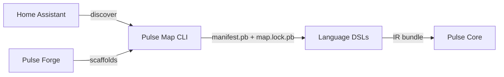

# Pulse Map

[](https://github.com/PulseAutomate/pulse-map/actions)
[](https://github.com/PulseAutomate/pulse-map/releases)
[](#license)


[](#contributing)

**Pulse Map** is the Home Assistant discovery and analysis tool in the **PulseAutomate** ecosystem. It connects to your HA instance and builds a stable-ID **manifest** of your entities and services. The command-line interface (CLI) allows you to discover your instance, validate your configuration's integrity, and view detailed stats about your smart home setup.

> 💡 *Map discovers & describes. DSLs consume. Core executes.*
> Map does **not** run automations; that’s **Pulse Core**.

---

## Table of Contents

* [Why Pulse Map?](#why-pulse-map)
* [How It Fits (The PulseAutomate System)](#how-it-fits-the-pulseautomate-system)
* [Status](#status)
* [Features (M1 Release)](#features-m1-release)
* [Requirements](#requirements)
* [Install](#install)
* [Quickstart](#quickstart)
* [CLI Usage](#cli-usage)
* [Configuration](#configuration)
* [The Manifest & Lock File](#the-manifest--lock-file)
* [Project Layout](#project-layout)
* [Build From Source](#build-from-source)
* [Roadmap](#roadmap)
* [Contributing](#contributing)
* [License](#license)

---

## Why Pulse Map?

Home Assistant entity IDs and service signatures can drift due to renames or integration changes. Pulse Map solves this by:

* **Creating stable IDs** so your code and automations won’t break when `light.kitchen` becomes `light.kitchen_ceiling`.
* **Building a reproducible manifest** of your smart home's state, attributes, and services in a compact, binary format.
* **Providing tools to validate and analyze** your configuration, helping you understand what's in your smart home and ensuring its integrity over time.

## How It Fits (The PulseAutomate System)



**PulseAutomate** is a language-agnostic automation stack:

* **Pulse Map** → Discovery, analysis, and manifest generation (this repo).
* **Pulse Core** → An automation engine that runs inside Home Assistant.
* **Pulse Forge** → Project scaffolding and toolchain management.

---

## Status

**v0.1.0-M1 is available!** This is the first milestone release, focused on providing a stable CLI for discovery, validation, and analysis of a Home Assistant instance. Follow the project's [Milestones](../../milestones) for future progress.

---

## Features (M1 Release)

* **Robust CLI** built with GraalVM for native executables on Linux, macOS, and Windows.
* **`discover` command** to connect to Home Assistant and generate a detailed manifest and lock file.
* **`validate` command** to check the integrity of a manifest against its lock file.
* **`stats` command** to print per-domain entity counts and attribute coverage.
* **Stable-ID Manifest** (`manifest.pb`) and a reproducible **Lock File** (`map.lock.pb`).
* **Attribute Inference** for common Home Assistant domains (`climate`, `light`, `fan`, `cover`, `media_player`, `number`).
* **Protobuf binary (default)** or optional JSON output formats.
    * **Note**: The `--json` flag is non-functional in the M1 release due to a known bug ([#42](https://github.com/PulseAutomate/pulse-map/issues/42)).

---

## Requirements

* **Java 21+** (Temurin/Zulu recommended for building).
* A running Home Assistant instance with its URL and a Long-Lived Access Token.

---

## Install

1.  Go to the [**Releases Page**](../../releases) and download the latest executable for your platform (e.g., `pulse-map-linux-amd64`).
2.  Place the executable on your system's `PATH` and make it executable (e.g., `chmod +x pulse-map-linux-amd64`).

---

## Quickstart

1.  **Discover your Home Assistant instance** using the default Protobuf format.

    ```bash
    pulse-map discover \
      --ha-url [http://homeassistant.local:8123](http://homeassistant.local:8123) \
      --ha-token $YOUR_HA_TOKEN \
      --out ./config
    ```

2.  **View statistics** about your discovered configuration.

    ```bash
    pulse-map stats --manifest ./config/manifest.pb
    ```

3.  **Validate the integrity** of your manifest and lock file.

    ```bash
    pulse-map validate --dir ./config
    ```

---

## CLI Usage

The `pulse-map` CLI has three main commands. You can get help for any command by using the `--help` flag.

```bash
# General help
pulse-map --help

# Help for the 'discover' command
pulse-map discover --help
```

### `discover`

Connects to Home Assistant and generates `manifest.pb` and `map.lock.pb` files.

```bash
# Discover and output to a 'build/pulse' directory
pulse-map discover --out ./build/pulse

# Use the --json flag for human-readable output instead of binary
# NOTE: This flag is non-functional in v0.1.0-M1. See issue #42.
pulse-map discover --out ./build/pulse --json

# Use the built-in demo data instead of connecting to a real HA instance
pulse-map discover --out ./build/pulse --demo
```

### `validate`

Checks that a `manifest.pb` file is in sync with its corresponding `map.lock.pb` file.

```bash
# Validate the files in the current directory
pulse-map validate

# Validate files in a specific directory with strict error checking
pulse-map validate --dir ./build/pulse --strict
```

### `stats`

Prints high-level statistics about the entities and services in a `manifest.pb` file.

```bash
# Show stats for a manifest file, showing the top 5 domains
pulse-map stats --manifest ./build/pulse/manifest.pb --top 5
```

---

## Configuration

For convenience, you can set environment variables instead of passing CLI flags. The `discover` command will use these as fallbacks.

* `HA_URL` — Your Home Assistant base URL (e.g., `http://homeassistant.local:8123`).
* `HA_TOKEN` — Your Home Assistant Long-Lived Access Token.
* `HA_VERSION` — An optional version string to embed in the manifest.

CLI flags will always override environment variables.

---

## The Manifest & Lock File

* **`manifest.pb`**: A detailed, binary snapshot of your Home Assistant instance. It describes every entity, its attributes (with types, units, and capability ranges), and all available services. This file can change between discoveries.

* **`map.lock.pb`**: A reproducible, binary lock file that assigns a **stable ID** to every entity. It also contains checksums for the manifest and service signatures. This file is designed to be checked into version control, allowing you to track changes to your smart home over time.

> You can use the `--json` flag with the `discover` command to generate human-readable `.json` versions of these files for inspection (Note: this is currently non-functional, see [#42](https://github.com/PulseAutomate/pulse-map/issues/42)).

---

## Project Layout

```
pulse-map/
├─ map-cli/              # picocli-based CLI (builds to GraalVM native-image)
├─ ha-client/            # REST client for Home Assistant
├─ manifest/             # Data model, builder, and attribute inference logic
├─ ... other modules
└─ gradle/               # libs.versions.toml (version catalog)
```

---

## Build From Source

**Prerequisites**: JDK 21+ and the Gradle wrapper. For native builds, you'll also need GraalVM.

```bash
# Run tests and build the JAR
./gradlew build

# Apply code formatting
./gradlew spotlessApply

# Build the native executable (e.g., for Linux)
./gradlew :map-cli:nativeCompile
```

---

## Roadmap

**M1 – Discover & Analyze (Complete)**

* Stable CLI with `discover`, `validate`, and `stats`.
* Manifest and lock file generation in Protobuf format.
* Attribute inference and stable ID creation.

**M2 – Code Generation**

* Introduce `proto` and `java` CLI commands to generate language-specific bindings from the manifest.
* Generate Protobuf definitions and typed Java classes for entities, services, and attributes.

**M3 – Daemon & gRPC**

* Develop `mapd`, a long-running daemon that watches Home Assistant for changes in real-time.
* Expose a gRPC API for other tools in the PulseAutomate ecosystem to consume.

---

## Contributing

We welcome contributions! Please see our `CONTRIBUTING.md` file (coming soon) for more details on our development process and how to get involved. We use and enforce **Conventional Commits**.

## License

Licensed under the **Apache License 2.0** — see the [LICENSE](./LICENSE) file for details.
